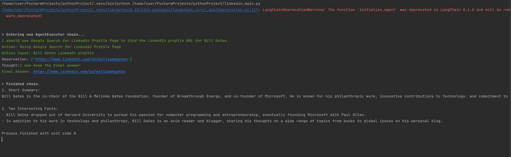

# Working_With_Agents_LangChain
Used Agents and LangChain to fetch LinkedIn profile URL using name of the person and summarising information about the person.

## TODO:

```
Given the name of a person, we have to:
1. Fetch the LinkedIn Profile URL of the person.
2. Fetch the profile summary of the person using the information on the LinkedIn profile page.
```

### Sample Output:


